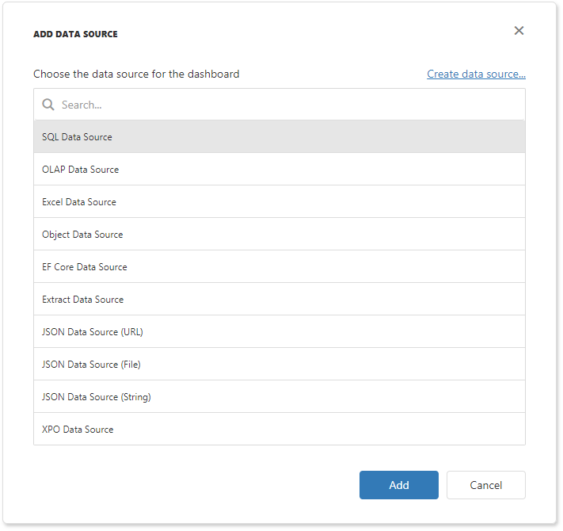

<!-- default badges list -->

<!-- default badges end -->

# Dashboard for Web Forms - How to Register Data Sources

This example displays how to supply a Web Dashboard with a set of predefined data sources available for users.

The [ASPxDashboard.SetDataSourceStorage](https://docs.devexpress.com/Dashboard/DevExpress.DashboardWeb.ASPxDashboard.SetDataSourceStorage(DevExpress.DashboardWeb.IDataSourceStorage)) method call registers the added data sources in data source storage.

The [ASPxDashboard.ConfigureDataConnection](https://docs.devexpress.com/Dashboard/DevExpress.DashboardWeb.ASPxDashboard.ConfigureDataConnection) event is handled to customize connection parameters before the Web Dashboard connects to a data store (database, OLAP cube, etc.).

<!-- default file list -->
## Files to Look At

* [EFDashboard.aspx.cs](./CS/WebFormsDashboardDataSources/Pages/EFDashboard.aspx.cs) (VB: [EFDashboard.aspx.vb](./VB/WebFormsDashboardDataSources/Pages/EFDashboard.aspx.vb))
* [ExcelDashboard.aspx.cs](./CS/WebFormsDashboardDataSources/Pages/ExcelDashboard.aspx.cs) (VB: [ExcelDashboard.aspx.vb](./VB/WebFormsDashboardDataSources/Pages/ExcelDashboard.aspx.vb))
* [ExtractDashboard.aspx.cs](./CS/WebFormsDashboardDataSources/Pages/ExtractDashboard.aspx.cs) (VB: [ExtractDashboard.aspx.vb](./VB/WebFormsDashboardDataSources/Pages/ExtractDashboard.aspx.vb))
* [JsonDashboard.aspx.cs](./CS/WebFormsDashboardDataSources/Pages/JsonDashboard.aspx.cs) (VB: [JsonDashboard.aspx.vb](./VB/WebFormsDashboardDataSources/Pages/JsonDashboard.aspx.vb))
* [ObjectDashboard.aspx.cs](./CS/WebFormsDashboardDataSources/Pages/ObjectDashboard.aspx.cs) (VB: [ObjectDashboard.aspx.vb](./VB/WebFormsDashboardDataSources/Pages/ObjectDashboard.aspx.vb))
* [OlapDashboard.aspx.cs](./CS/WebFormsDashboardDataSources/Pages/OlapDashboard.aspx.cs) (VB: [OlapDashboard.aspx.vb](./VB/WebFormsDashboardDataSources/Pages/OlapDashboard.aspx.vb))
* [SqlDashboard.aspx.cs](./CS/WebFormsDashboardDataSources/Pages/SqlDashboard.aspx.cs) (VB: [SqlDashboard.aspx.vb](./VB/WebFormsDashboardDataSources/Pages/SqlDashboard.aspx.vb))
* [XpoDashboard.aspx.cs](./CS/WebFormsDashboardDataSources/Pages/XpoDashboard.aspx.cs) (VB: [XpoDashboard.aspx.vb](./VB/WebFormsDashboardDataSources/Pages/XpoDashboard.aspx.vb))
<!-- default file list end-->

## Documentation

- [Register Default Data Sources](https://docs.devexpress.com/Dashboard/116300/web-dashboard/aspnet-web-forms-dashboard-control/register-default-data-sources)

## More Examples
- [Dashboard for Web Forms - How to Work with a Data Extract](https://github.com/DevExpress-Examples/web-forms-dashboard-extract-data-source)
- [How to Register Data Sources for ASP.NET Core Dashboard Control](https://github.com/DevExpress-Examples/asp-net-core-dashboard-register-data-sources)
- [How to Register Data Sources for ASP.NET MVC Dashboard Extension](https://github.com/DevExpress-Examples/asp-net-mvc-dashboard-register-data-sources)
